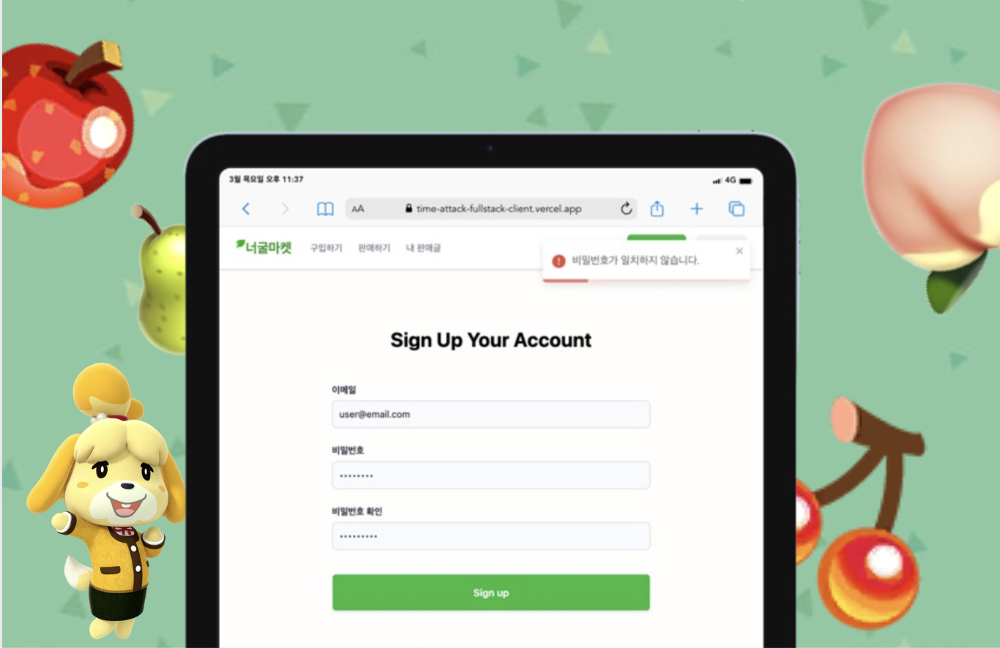
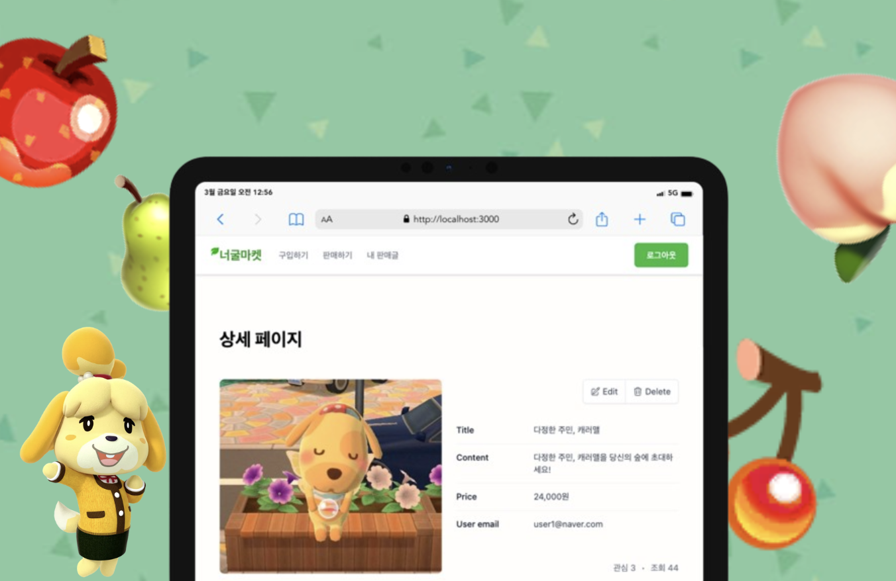

# 
[너굴 마켓 🌿](https://neogul-market.vercel.app)

## 🌿 목차

[1. 프로젝트 소개](https://github.com/haizellatte/neogul-market-client?tab=readme-ov-file#1-%ED%94%84%EB%A1%9C%EC%A0%9D%ED%8A%B8-%EC%86%8C%EA%B0%9C)  
[2. 서비스 소개](https://github.com/haizellatte/neogul-market-client?tab=readme-ov-file#2-%EC%84%9C%EB%B9%84%EC%8A%A4-%EC%86%8C%EA%B0%9C)  
[3. 기술 스택](https://github.com/haizellatte/neogul-market-client?tab=readme-ov-file#3-%EA%B8%B0%EC%88%A0-%EC%8A%A4%ED%83%9D)  
[4. 구현 기능](https://github.com/haizellatte/neogul-market-client?tab=readme-ov-file#4-%EA%B5%AC%ED%98%84-%EA%B8%B0%EB%8A%A5)  
[5. 회고 / 느낀점](https://github.com/haizellatte/neogul-market-client?tab=readme-ov-file#4-%EA%B5%AC%ED%98%84-%EA%B8%B0%EB%8A%A5)

 

## 1. 프로젝트 소개

유데미 X 사람인 풀스택 부트캠프에서 개인 과제로 진행한 **1인 프로젝트**입니다.  
총 제작 기간: 2024.03.27 - 2024.03.29 (3 day)

🔗 [발표 PPT](https://www.canva.com/design/DAF_a0H76nY/hAJ9HXTiwTIC9NB1jDGUyg/view?utm_content=DAF_a0H76nY&utm_campaign=designshare&utm_medium=link&utm_source=editor)

 

## 2. 서비스 소개

닌텐도의 "모여라 동물의 숲"은 유저가 처음 서비스를 시작할 때, 유저의 숲에 주민들이 랜덤으로 초대됩니다.  
이때 "내가 원하는 주민들을 내 숲에 초대하고, 다른 유저의 숲으로 보낼 수 있는 서비스가 있으면 좋겠다" 라는 생각에 해당 서비스를 만들게 되었습니다.

 

## 3. 기술 스택

- Typescript
- Next.js
- TailwindCSS
- React Query
- Zod

 

## 4. 구현 기능

### 🌿 회원 인증

|           회원가입 페이지            |            로그인 페이지            |
| :----------------------------------: | :---------------------------------: |
|  |  |

- 회원가입 / 로그인 시 `Zod` 라이브러리를 이용한 이메일 및 비밀번호의 유효성 검사
- 좀 더 나은 유저 경험을 위해 회원가입, 로그인, 로그아웃 시 `react-toastify`를 활용한 alert 창 구현
- `context API`를 활용한 로그인 모달 구현
-

 

### 🌿 메인 & 게시물 작성

|            메인 페이지             |         게시물 작성 페이지         |
| :--------------------------------: | :--------------------------------: |
|  |  |

- 게시물 최신순, 조회순, 관심순 정렬 기능
- `formData`를 활용한 이미지 업로드 기능
- 각 입력 Field의 유효성을 검증하여, 유효성 통과 시 **체크 아이콘이 활성화**되도록 구현

 

### 🌿 로그인 유무에 따른 게시물 상세 페이지

|             메인 페이지              |            게시물 작성 페이지             |
| :----------------------------------: | :---------------------------------------: |
|  |  |

- 타 유저의 게시물일 때, 관심 및 관심 취소 기능 활성화
- 유저의 게시물이라면 수정 및 삭제 기능 활성화

 

### 🌿 반응형 웹 구현

|             반응형 웹             |
| :-------------------------------: |
|  |

- 데스크탑, 태블릿, 모바일에 따른 반응형 웹 구현

 

## 5. 회고 / 느낀점

이번 개인 프로젝트에서 '너굴 마켓'을 처음부터 끝까지 혼자 구현해보며 많은 점을 배웠습니다.

**Next.js와 Nest.js를 활용해 처음으로 풀스택 개발을 경험**해보며 큰 규모의 프로젝트는 아니었지만, 클라이언트와 서버 간의 상호작용과 통신 방식을 직접 설계하고 구현해볼 수 있었습니다. 특히 클라이언트에서는 요청을 생성하고, 서버에서는 이러한 요청을 처리하여 적절한 데이터를 응답하는 과정을 직접 구현하면서, 각각의 역할과 중요성을 배웠습니다.

그리고 **사용자 인터페이스(UI)와 사용자 경험(UX)을 중심으로** 프론트엔드 개발을 진행하면서, 사용자 중심 설계의 중요성과 클라이언트와 서버의 상태 관리의 중요성을 느꼈습니다.

한편, 한정된 시간 안에 세부 사항에 지나치게 많은 시간을 투자하다 보니 전반적인 기능 구현과 개선에 충분히 집중하지 못한 점이 아쉬움으로 남습니다. 하지만 그 덕분에, 앞으로 프로젝트를 진행할 때는 기능 구현의 우선순위를 보다 명확히 설정해야 한다는 점을 배울 수 있었습니다. 또한 클라이언트-서버 간 통신 과정에서 중요한 요소들을 효율적으로 설계하는 것의 중요성을 배웠습니다.

이번 프로젝트는 풀스택 개발에 대한 이해를 깊게 하고 Next.js와 Nest.js를 직접 적용해 볼 수 있는 소중한 경험이었습니다. 이 경험을 바탕으로, 앞으로 다양한 프로젝트에 도전하며 사용자에게 가치를 제공하는 개발자로 성장해 나가고 싶습니다.
